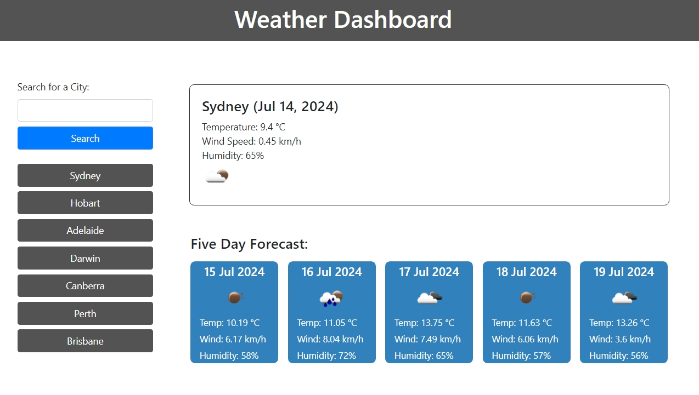

# weather-dashboard

06-Server-Side-APIs/02-Challenge - 5-day weather forecast dashboard using HTML, CSS, JavaScript and APIs

## Description

Module 6 - Server Side APIs: Weather Dashboard using OpenWeather API

Development of HTML and JavaScript using OpenWeather current weather data and 5-day/3-hour forecast data APIs to create a weather dashboard, through the execution of the following:

- fillable search bar clickable form submit
- storage of search terms data into local storage for search history
- clickable buttons of previous searched cities for easy re-rendering
- display of current weather data and five day forecast for searched city

Project executed in accordance with the following challenge requirements:

### User Story

```md
AS A traveler
I WANT to see the weather outlook for multiple cities
SO THAT I can plan a trip accordingly
```

### Acceptance Criteria

```md
GIVEN a weather dashboard with form inputs
WHEN I search for a city
THEN I am presented with current and future conditions for that city and that city is added to the search history
WHEN I view current weather conditions for that city
THEN I am presented with the city name, the date, an icon representation of weather conditions, the temperature, the humidity, and the wind speed
WHEN I view future weather conditions for that city
THEN I am presented with a 5-day forecast that displays the date, an icon representation of weather conditions, the temperature, the wind speed, and the humidity
WHEN I click on a city in the search history
THEN I am again presented with current and future conditions for that city
```

## Table of Contents

- [Installation](#installation)
- [Usage](#usage)
- [Credits](#credits)
- [License](#license)

## Installation

Git and an IDE (VSCode recommended) are required to be installed on your computer to clone and view the code for this web application.

From your command line:

```md
### Clone this repository
$ git clone git@github.com:ajhearne-mZAOSW/weather-dashboard.git

### Navigate into the repository
$ cd weather-dashboard

### Open in IDE
$ code .
```

## Usage

The following image shows the web application's appearance and functionality:



The web application is depoloyed using GitHub Pages: (<https://ajhearne-mzaosw.github.io/weather-dashboard/>).

## Credits

- fetch code snippets provided by University of Sydney, USYD-VIRT-FSF-PT-05-2024-U-LOLC/06-Server-Side-APIs/01-Activities

## License

MIT
